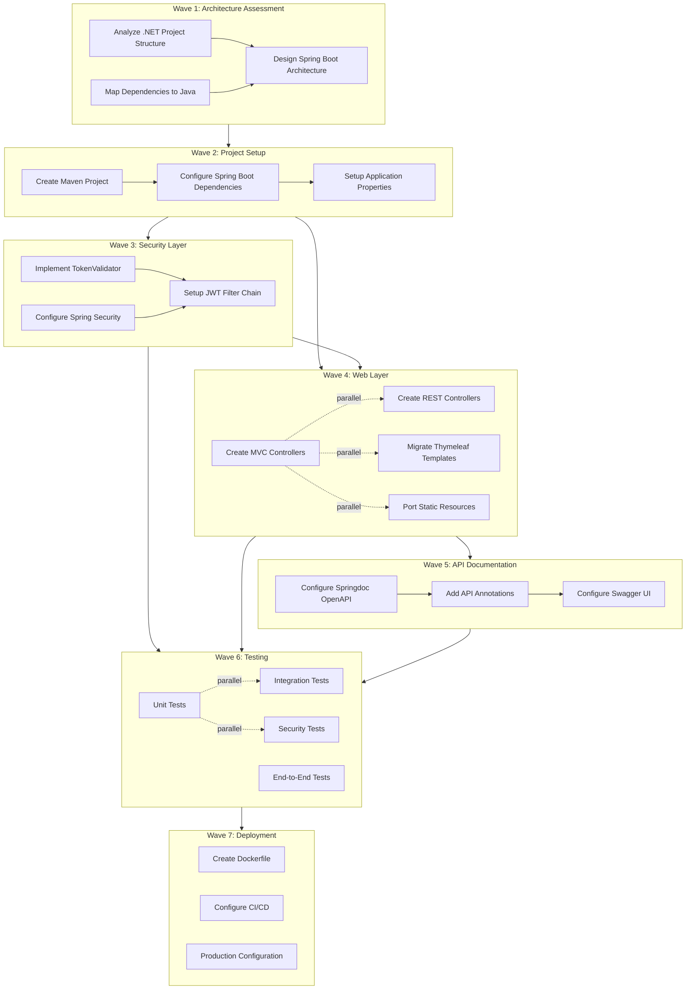

# .NET Framework 4.8 to Java 17/Spring Boot Migration Plan

## Executive Summary

This document provides a comprehensive migration plan for converting the Descope Sample Application from .NET Framework 4.8 (ASP.NET MVC/Web API) to Java 17 with Spring Boot 3.2. The migration preserves all functionality including JWT authentication with Descope integration, MVC views, REST API endpoints, and API documentation.

## Table of Contents

1. [Architecture Overview](#architecture-overview)
2. [Dependency Graph](#dependency-graph)
3. [Migration Waves](#migration-waves)
4. [AI Agent Prompts](#ai-agent-prompts)
5. [Parallel Execution Matrix](#parallel-execution-matrix)
6. [Technology Mapping](#technology-mapping)
7. [Risk Assessment](#risk-assessment)

---

## Architecture Overview

### Source Application (.NET Framework 4.8)

```
DescopeSampleApp/
├── App_Start/                    # Application startup configuration
│   ├── BundleConfig.cs          # Asset bundling (jQuery, Bootstrap, CSS)
│   ├── FilterConfig.cs          # Global error handling filters
│   ├── RouteConfig.cs           # MVC URL routing
│   └── WebApiConfig.cs          # Web API routing configuration
├── Areas/
│   └── HelpPage/                # Auto-generated API documentation
│       ├── App_Start/           # HelpPage configuration
│       ├── Controllers/         # Documentation controllers
│       ├── ModelDescriptions/   # Type description system
│       ├── Models/              # View models
│       ├── SampleGeneration/    # Request/response examples
│       └── Views/               # Documentation views
├── Controllers/
│   ├── HomeController.cs        # MVC controller for views
│   └── SampleController.cs      # Web API controller (protected)
├── Views/                       # Razor views
├── Login.aspx                   # Login page with Descope Web Component
├── AuthenticatedPage.aspx       # Protected page with API testing
├── TokenValidator.cs            # JWT validation with Descope
├── Global.asax.cs               # Application entry point
├── Web.config                   # Application configuration
└── packages.config              # NuGet dependencies
```

### Target Application (Java 17/Spring Boot 3.2)

```
migrated-to-java-17/
├── src/main/java/com/descope/sample/
│   ├── DescopeSampleApplication.java    # Spring Boot entry point
│   ├── config/
│   │   ├── SecurityConfig.java          # Spring Security configuration
│   │   ├── OpenApiConfig.java           # Swagger/OpenAPI configuration
│   │   └── WebConfig.java               # Web MVC configuration
│   ├── controller/
│   │   ├── HomeController.java          # MVC controller (@Controller)
│   │   └── SampleApiController.java     # REST controller (@RestController)
│   ├── security/
│   │   └── TokenValidator.java          # JWT validation service
│   ├── service/                         # Business logic services
│   └── model/                           # Data models/DTOs
├── src/main/resources/
│   ├── application.properties           # Application configuration
│   ├── templates/                       # Thymeleaf templates
│   │   ├── home.html
│   │   ├── login.html
│   │   └── authenticated.html
│   └── static/                          # Static resources
│       ├── css/
│       └── js/
├── src/test/java/                       # Test classes
└── pom.xml                              # Maven dependencies
```

---

## Dependency Graph

### Mermaid Diagram - Migration Task Dependencies



### ASCII Dependency Graph

```
┌─────────────────────────────────────────────────────────────────────────────┐
│                        MIGRATION DEPENDENCY GRAPH                            │
├─────────────────────────────────────────────────────────────────────────────┤
│                                                                              │
│  ┌──────────────────────────────────────────────────────────────────────┐   │
│  │ WAVE 1: Architecture Assessment & Planning                            │   │
│  │ ┌─────────────┐  ┌─────────────┐  ┌─────────────┐                    │   │
│  │ │ A1: Analyze │  │ A2: Map     │  │ A3: Design  │                    │   │
│  │ │ .NET Struct │──│ Dependencies│──│ Spring Arch │                    │   │
│  │ └─────────────┘  └─────────────┘  └─────────────┘                    │   │
│  └──────────────────────────────────────────────────────────────────────┘   │
│                                    │                                         │
│                                    ▼                                         │
│  ┌──────────────────────────────────────────────────────────────────────┐   │
│  │ WAVE 2: Project Setup & Dependencies                                  │   │
│  │ ┌─────────────┐  ┌─────────────┐  ┌─────────────┐                    │   │
│  │ │ B1: Create  │──│ B2: Config  │──│ B3: Setup   │                    │   │
│  │ │ Maven Proj  │  │ Dependencies│  │ Properties  │                    │   │
│  │ └─────────────┘  └─────────────┘  └─────────────┘                    │   │
│  └──────────────────────────────────────────────────────────────────────┘   │
│                          │                    │                              │
│                          ▼                    ▼                              │
│  ┌────────────────────────────┐  ┌────────────────────────────────────┐    │
│  │ WAVE 3: Security Layer     │  │ WAVE 4: Web Layer (PARALLEL)       │    │
│  │ ┌────────┐ ┌────────┐     │  │ ┌────────┐ ┌────────┐ ┌────────┐  │    │
│  │ │C1:Token│─│C2:Spring│    │  │ │D1: MVC │ │D2: REST│ │D3:Views│  │    │
│  │ │Validatr│ │Security │    │  │ │ Contrl │ │ Contrl │ │Thymeleaf│  │    │
│  │ └────────┘ └────────┘     │  │ └────────┘ └────────┘ └────────┘  │    │
│  │      │          │         │  │      ║          ║          ║       │    │
│  │      └────┬─────┘         │  │      ╚══════════╩══════════╝       │    │
│  │           ▼               │  │           (can run in parallel)    │    │
│  │      ┌────────┐           │  │                                    │    │
│  │      │C3: JWT │           │  │ ┌────────┐                         │    │
│  │      │ Filter │           │  │ │D4:Static│                        │    │
│  │      └────────┘           │  │ │Resources│                        │    │
│  └────────────────────────────┘  │ └────────┘                         │    │
│                          │       └────────────────────────────────────┘    │
│                          │                    │                              │
│                          └────────┬───────────┘                              │
│                                   ▼                                          │
│  ┌──────────────────────────────────────────────────────────────────────┐   │
│  │ WAVE 5: API Documentation                                             │   │
│  │ ┌─────────────┐  ┌─────────────┐  ┌─────────────┐                    │   │
│  │ │ E1: Config  │──│ E2: Add API │──│ E3: Config  │                    │   │
│  │ │ Springdoc   │  │ Annotations │  │ Swagger UI  │                    │   │
│  │ └─────────────┘  └─────────────┘  └─────────────┘                    │   │
│  └──────────────────────────────────────────────────────────────────────┘   │
│                                    │                                         │
│                                    ▼                                         │
│  ┌──────────────────────────────────────────────────────────────────────┐   │
│  │ WAVE 6: Testing & Validation (PARALLEL)                               │   │
│  │ ┌─────────────┐  ┌─────────────┐  ┌─────────────┐  ┌─────────────┐  │   │
│  │ │ F1: Unit    │  │ F2: Integr  │  │ F3: Security│  │ F4: E2E     │  │   │
│  │ │ Tests       │  │ Tests       │  │ Tests       │  │ Tests       │  │   │
│  │ └─────────────┘  └─────────────┘  └─────────────┘  └─────────────┘  │   │
│  │       ║               ║                ║                ║            │   │
│  │       ╚═══════════════╩════════════════╩════════════════╝            │   │
│  │                    (can run in parallel)                              │   │
│  └──────────────────────────────────────────────────────────────────────┘   │
│                                    │                                         │
│                                    ▼                                         │
│  ┌──────────────────────────────────────────────────────────────────────┐   │
│  │ WAVE 7: Deployment & Production                                       │   │
│  │ ┌─────────────┐  ┌─────────────┐  ┌─────────────┐                    │   │
│  │ │ G1: Create  │──│ G2: Config  │──│ G3: Prod    │                    │   │
│  │ │ Dockerfile  │  │ CI/CD       │  │ Config      │                    │   │
│  │ └─────────────┘  └─────────────┘  └─────────────┘                    │   │
│  └──────────────────────────────────────────────────────────────────────┘   │
│                                                                              │
└─────────────────────────────────────────────────────────────────────────────┘

LEGEND:
  ──▶  Sequential dependency (must complete before next)
  ═══  Parallel execution allowed
  ┌─┐  Task block
```

---

## Migration Waves

### Wave 1: Architecture Assessment & Planning

**Duration:** 1-2 days  
**Prerequisites:** None  
**Parallel Execution:** Tasks A1 and A2 can run in parallel

#### Task A1: Analyze .NET Project Structure

**Objective:** Document the complete structure of the .NET application including all dependencies, configurations, and code patterns.

**Files to Analyze:**
- `DescopeSampleApp/DescopeSampleApp.csproj` - Project dependencies and references
- `DescopeSampleApp/packages.config` - NuGet package versions
- `DescopeSampleApp/Global.asax.cs` - Application startup sequence
- `DescopeSampleApp/Web.config` - Application configuration

**Deliverables:**
- Complete dependency inventory
- Configuration mapping document
- Code pattern analysis

#### Task A2: Map Dependencies to Java Equivalents

**Objective:** Create a mapping of all .NET packages to their Java equivalents.

**Key Mappings:**
| .NET Package | Version | Java Equivalent | Version |
|-------------|---------|-----------------|---------|
| jose-jwt | 5.0.0 | com.auth0:java-jwt | 4.4.0 |
| System.IdentityModel.Tokens.Jwt | 7.5.1 | spring-security-oauth2-resource-server | 3.2.0 |
| Newtonsoft.Json | 13.0.3 | com.fasterxml.jackson.core:jackson-databind | 2.15.x |
| Microsoft.AspNet.Mvc | 5.2.9 | spring-boot-starter-web | 3.2.0 |
| Microsoft.AspNet.WebApi | 5.2.9 | spring-boot-starter-web | 3.2.0 |
| Microsoft.AspNet.WebApi.HelpPage | 5.2.9 | springdoc-openapi-starter-webmvc-ui | 2.3.0 |
| Bootstrap | 5.2.3 | Bootstrap (CDN) | 5.2.3 |
| jQuery | 3.4.1 | jQuery (CDN) | 3.4.1 |

#### Task A3: Design Spring Boot Architecture

**Objective:** Create the target architecture design for the Spring Boot application.

**Deliverables:**
- Package structure diagram
- Component interaction diagram
- Security flow diagram

---

### Wave 2: Project Setup & Dependencies

**Duration:** 0.5-1 day  
**Prerequisites:** Wave 1 completed  
**Parallel Execution:** None (sequential)

#### Task B1: Create Maven Project

**Objective:** Initialize the Spring Boot project with Maven build configuration.

**Files to Create:**
- `pom.xml` - Maven project configuration
- `src/main/java/com/descope/sample/DescopeSampleApplication.java` - Main application class

#### Task B2: Configure Spring Boot Dependencies

**Objective:** Add all required dependencies to the Maven POM file.

**Required Dependencies:**
- spring-boot-starter-web
- spring-boot-starter-security
- spring-boot-starter-oauth2-resource-server
- spring-boot-starter-thymeleaf
- springdoc-openapi-starter-webmvc-ui
- com.auth0:java-jwt
- com.auth0:jwks-rsa

#### Task B3: Setup Application Properties

**Objective:** Configure application properties equivalent to Web.config settings.

**Files to Create:**
- `src/main/resources/application.properties`

---

### Wave 3: Authentication Layer Rewrite

**Duration:** 2-3 days  
**Prerequisites:** Wave 2 completed  
**Parallel Execution:** Tasks C1 and C2 can run in parallel

#### Task C1: Implement TokenValidator

**Objective:** Port the TokenValidator.cs class to Java.

**Source File:** `DescopeSampleApp/TokenValidator.cs`  
**Target File:** `src/main/java/com/descope/sample/security/TokenValidator.java`

**Key Methods to Port:**
- `ValidateSession(string sessionToken)` → `validateSession(String sessionToken)`
- `VerifyTokenExpiration(string sessionToken)` → `verifyTokenExpiration(String sessionToken)`
- `GetPublicKeyAsync(string projectId)` → Handled by JwkProvider

#### Task C2: Configure Spring Security

**Objective:** Setup Spring Security with OAuth2 Resource Server for JWT validation.

**Target File:** `src/main/java/com/descope/sample/config/SecurityConfig.java`

**Configuration Requirements:**
- Disable CSRF for stateless API
- Configure stateless session management
- Define public and protected endpoints
- Configure JWT validation with Descope JWKS endpoint

#### Task C3: Setup JWT Filter Chain

**Objective:** Integrate JWT validation into the Spring Security filter chain.

**Prerequisites:** Tasks C1 and C2 completed

---

### Wave 4: Web Layer Migration

**Duration:** 2-3 days  
**Prerequisites:** Wave 2 completed (Wave 3 for protected endpoints)  
**Parallel Execution:** All tasks (D1, D2, D3, D4) can run in parallel

#### Task D1: Create MVC Controllers

**Objective:** Port ASP.NET MVC controllers to Spring MVC @Controller classes.

**Source File:** `DescopeSampleApp/Controllers/HomeController.cs`  
**Target File:** `src/main/java/com/descope/sample/controller/HomeController.java`

**Mapping:**
- `Controller` base class → `@Controller` annotation
- `ActionResult` → `String` (view name)
- `ViewBag` → `Model` parameter
- `View()` → Return view name string

#### Task D2: Create REST Controllers

**Objective:** Port ASP.NET Web API controllers to Spring @RestController classes.

**Source File:** `DescopeSampleApp/Controllers/SampleController.cs`  
**Target File:** `src/main/java/com/descope/sample/controller/SampleApiController.java`

**Mapping:**
- `ApiController` base class → `@RestController` annotation
- `IHttpActionResult` → `ResponseEntity<T>`
- `Request.Headers.Authorization` → `@AuthenticationPrincipal Jwt jwt`
- `Ok()` → `ResponseEntity.ok()`
- `Unauthorized()` → `ResponseEntity.status(401)`

#### Task D3: Migrate Thymeleaf Templates

**Objective:** Convert ASPX pages and Razor views to Thymeleaf templates.

**Source Files:**
- `DescopeSampleApp/Login.aspx`
- `DescopeSampleApp/AuthenticatedPage.aspx`
- `DescopeSampleApp/Views/Home/Index.cshtml`

**Target Files:**
- `src/main/resources/templates/login.html`
- `src/main/resources/templates/authenticated.html`
- `src/main/resources/templates/home.html`

**Syntax Mapping:**
| Razor/ASPX | Thymeleaf |
|------------|-----------|
| `@ViewBag.Title` | `th:text="${title}"` |
| `@Html.ActionLink()` | `th:href="@{/path}"` |
| `@if (condition)` | `th:if="${condition}"` |
| `@foreach` | `th:each` |
| `<%= %>` | `th:text` |

#### Task D4: Port Static Resources

**Objective:** Migrate CSS, JavaScript, and other static assets.

**Source Files:**
- `DescopeSampleApp/Content/site.css`
- `DescopeSampleApp/Scripts/`

**Target Location:**
- `src/main/resources/static/css/`
- `src/main/resources/static/js/`

---

### Wave 5: API Documentation Migration

**Duration:** 1 day  
**Prerequisites:** Wave 4 completed  
**Parallel Execution:** None (sequential)

#### Task E1: Configure Springdoc OpenAPI

**Objective:** Replace ASP.NET Help Page with Springdoc OpenAPI.

**Source Files to Reference:**
- `DescopeSampleApp/Areas/HelpPage/App_Start/HelpPageConfig.cs`
- `DescopeSampleApp/Areas/HelpPage/HelpPageAreaRegistration.cs`

**Target File:** `src/main/java/com/descope/sample/config/OpenApiConfig.java`

#### Task E2: Add API Annotations

**Objective:** Add OpenAPI annotations to REST controllers for documentation.

**Annotations to Use:**
- `@Tag` - Group related endpoints
- `@Operation` - Describe endpoint purpose
- `@ApiResponse` - Document response codes
- `@Schema` - Describe request/response models
- `@SecurityRequirement` - Document authentication requirements

#### Task E3: Configure Swagger UI

**Objective:** Configure Swagger UI appearance and behavior.

**Configuration in `application.properties`:**
```properties
springdoc.api-docs.path=/v3/api-docs
springdoc.swagger-ui.path=/swagger-ui.html
springdoc.swagger-ui.enabled=true
```

---

### Wave 6: Testing & Validation

**Duration:** 2-3 days  
**Prerequisites:** Waves 3, 4, and 5 completed  
**Parallel Execution:** All tasks (F1, F2, F3, F4) can run in parallel

#### Task F1: Unit Tests

**Objective:** Create unit tests for individual components.

**Test Classes:**
- `TokenValidatorTest.java`
- `SampleApiControllerTest.java`
- `HomeControllerTest.java`

#### Task F2: Integration Tests

**Objective:** Create integration tests for component interactions.

**Test Classes:**
- `SecurityConfigIntegrationTest.java`
- `ApiEndpointIntegrationTest.java`

#### Task F3: Security Tests

**Objective:** Verify JWT authentication and authorization.

**Test Scenarios:**
- Valid JWT token access
- Expired JWT token rejection
- Missing JWT token rejection
- Invalid JWT signature rejection

#### Task F4: End-to-End Tests

**Objective:** Verify complete user flows.

**Test Scenarios:**
- Login flow with Descope
- Authenticated API access
- Swagger UI accessibility

---

### Wave 7: Deployment & Production

**Duration:** 1-2 days  
**Prerequisites:** Wave 6 completed  
**Parallel Execution:** None (sequential)

#### Task G1: Create Dockerfile

**Objective:** Containerize the Spring Boot application.

**Deliverable:** `Dockerfile`

#### Task G2: Configure CI/CD

**Objective:** Setup continuous integration and deployment pipeline.

**Deliverables:**
- `.github/workflows/build.yml` (for GitHub Actions)
- Build and test automation
- Docker image publishing

#### Task G3: Production Configuration

**Objective:** Create production-ready configuration.

**Deliverables:**
- `application-prod.properties`
- Environment variable documentation
- Security hardening checklist

---

## AI Agent Prompts

### Wave 1 Prompts

#### Prompt A1: Analyze .NET Project Structure

```
TASK: Analyze the .NET Framework 4.8 application structure

CONTEXT:
You are analyzing a .NET Framework 4.8 ASP.NET application that needs to be migrated to Java/Spring Boot.

FILES TO READ:
1. DescopeSampleApp/DescopeSampleApp.csproj - Project file with all dependencies
2. DescopeSampleApp/packages.config - NuGet package versions
3. DescopeSampleApp/Global.asax.cs - Application startup and configuration
4. DescopeSampleApp/Web.config - Application settings and runtime configuration

INSTRUCTIONS:
1. Read each file listed above
2. Create a comprehensive inventory of:
   - All NuGet package dependencies with versions
   - All project references
   - Application startup sequence (what gets initialized in Application_Start)
   - Configuration settings from Web.config
3. Document the application architecture:
   - MVC controllers and their routes
   - Web API controllers and their routes
   - Areas (like HelpPage)
   - Views and their locations
4. Output a structured analysis document

DELIVERABLE:
A markdown document containing:
- Dependency inventory table
- Startup sequence diagram
- Configuration mapping
- Architecture overview

PARALLEL EXECUTION: This task can run in parallel with Task A2.
```

#### Prompt A2: Map Dependencies to Java

```
TASK: Create a dependency mapping from .NET to Java

CONTEXT:
You need to identify Java equivalents for all .NET packages used in the application.

FILES TO READ:
1. DescopeSampleApp/packages.config - Complete list of NuGet packages
2. DescopeSampleApp/DescopeSampleApp.csproj - Additional references

INSTRUCTIONS:
1. Read the packages.config file to get all NuGet dependencies
2. For each package, identify:
   - The Java equivalent library
   - The recommended version for Java 17/Spring Boot 3.2
   - Any API differences to note
3. Pay special attention to:
   - jose-jwt → com.auth0:java-jwt
   - System.IdentityModel.Tokens.Jwt → Spring Security OAuth2
   - Newtonsoft.Json → Jackson
   - Microsoft.AspNet.Mvc → Spring MVC
   - Microsoft.AspNet.WebApi → Spring Web
   - Microsoft.AspNet.WebApi.HelpPage → Springdoc OpenAPI

DELIVERABLE:
A mapping table with columns:
- .NET Package Name
- .NET Version
- Java Equivalent
- Java Version
- Migration Notes

PARALLEL EXECUTION: This task can run in parallel with Task A1.
```

#### Prompt A3: Design Spring Boot Architecture

```
TASK: Design the target Spring Boot application architecture

CONTEXT:
Based on the analysis from Tasks A1 and A2, design the Spring Boot application structure.

PREREQUISITES:
- Task A1 (Analyze .NET Project Structure) must be completed
- Task A2 (Map Dependencies to Java) must be completed

FILES TO REFERENCE:
1. DescopeSampleApp/Global.asax.cs - Understand startup sequence
2. DescopeSampleApp/App_Start/*.cs - Configuration classes
3. DescopeSampleApp/Controllers/*.cs - Controller patterns

INSTRUCTIONS:
1. Design the Java package structure:
   - com.descope.sample (root)
   - com.descope.sample.config (configuration classes)
   - com.descope.sample.controller (web controllers)
   - com.descope.sample.security (security components)
   - com.descope.sample.service (business logic)
   - com.descope.sample.model (data models)
2. Map .NET concepts to Spring:
   - Global.asax.Application_Start → @SpringBootApplication
   - RouteConfig → @Controller/@RestController annotations
   - FilterConfig → @ControllerAdvice or SecurityFilterChain
   - WebApiConfig → @RestController with @RequestMapping
3. Design the security flow for JWT validation

DELIVERABLE:
- Package structure diagram
- Component mapping document
- Security flow diagram

PARALLEL EXECUTION: This task must wait for A1 and A2 to complete.
```

### Wave 2 Prompts

#### Prompt B1: Create Maven Project

```
TASK: Initialize the Spring Boot Maven project

CONTEXT:
Create the foundational Maven project structure for the Spring Boot application.

PREREQUISITES:
- Wave 1 must be completed

INSTRUCTIONS:
1. Create the directory structure:
   migrated-to-java-17/
   ├── src/main/java/com/descope/sample/
   ├── src/main/resources/
   ├── src/test/java/com/descope/sample/
   └── pom.xml

2. Create pom.xml with:
   - Parent: spring-boot-starter-parent 3.2.0
   - Java version: 17
   - Group ID: com.descope
   - Artifact ID: descope-sample-app

3. Create the main application class:
   DescopeSampleApplication.java with @SpringBootApplication

DELIVERABLE:
- pom.xml file
- DescopeSampleApplication.java file
- Directory structure

PARALLEL EXECUTION: None - this is the first task in Wave 2.
```

#### Prompt B2: Configure Spring Boot Dependencies

```
TASK: Add all required dependencies to the Maven POM

CONTEXT:
Configure the complete set of dependencies needed for the migration.

PREREQUISITES:
- Task B1 must be completed
- Dependency mapping from Task A2

FILES TO MODIFY:
- migrated-to-java-17/pom.xml

INSTRUCTIONS:
Add the following dependencies:
1. Spring Boot Starters:
   - spring-boot-starter-web
   - spring-boot-starter-security
   - spring-boot-starter-oauth2-resource-server
   - spring-boot-starter-thymeleaf
   - spring-boot-starter-validation
   - spring-boot-starter-actuator

2. JWT Libraries:
   - com.auth0:java-jwt:4.4.0
   - com.auth0:jwks-rsa:0.22.1

3. API Documentation:
   - springdoc-openapi-starter-webmvc-ui:2.3.0

4. Development Tools:
   - spring-boot-devtools (runtime, optional)
   - lombok (optional)

5. Testing:
   - spring-boot-starter-test
   - spring-security-test

DELIVERABLE:
Updated pom.xml with all dependencies

PARALLEL EXECUTION: None - depends on B1.
```

#### Prompt B3: Setup Application Properties

```
TASK: Create application.properties configuration

CONTEXT:
Migrate Web.config settings to Spring Boot application.properties.

PREREQUISITES:
- Task B2 must be completed

FILES TO REFERENCE:
- DescopeSampleApp/Web.config

FILES TO CREATE:
- migrated-to-java-17/src/main/resources/application.properties

INSTRUCTIONS:
1. Configure server settings:
   - server.port=8080

2. Configure Descope integration:
   - descope.project-id=${DESCOPE_PROJECT_ID}
   - spring.security.oauth2.resourceserver.jwt.jwk-set-uri

3. Configure Thymeleaf:
   - spring.thymeleaf.prefix=classpath:/templates/
   - spring.thymeleaf.suffix=.html

4. Configure OpenAPI/Swagger:
   - springdoc.api-docs.path=/v3/api-docs
   - springdoc.swagger-ui.path=/swagger-ui.html

5. Configure logging:
   - logging.level.com.descope.sample=DEBUG

DELIVERABLE:
application.properties file with all configurations

PARALLEL EXECUTION: None - depends on B2.
```

### Wave 3 Prompts

#### Prompt C1: Implement TokenValidator

```
TASK: Port TokenValidator.cs to Java

CONTEXT:
Convert the .NET TokenValidator class to a Spring component using Auth0 JWT libraries.

PREREQUISITES:
- Wave 2 must be completed

FILES TO READ:
- DescopeSampleApp/TokenValidator.cs

FILES TO CREATE:
- migrated-to-java-17/src/main/java/com/descope/sample/security/TokenValidator.java

INSTRUCTIONS:
1. Analyze the .NET TokenValidator.cs:
   - Constructor takes projectId
   - ValidateSession() validates JWT using JWKS
   - VerifyTokenExpiration() checks token expiry
   - GetPublicKeyAsync() fetches JWKS from Descope

2. Create Java equivalent:
   - Use @Component annotation
   - Inject projectId via @Value("${descope.project-id}")
   - Use JwkProviderBuilder for JWKS fetching with caching
   - Use JWT.decode() and JWT.require() for validation

3. Key differences to handle:
   - .NET uses jose-jwt library → Java uses com.auth0:java-jwt
   - .NET JwkSet → Java JwkProvider
   - Async methods → Sync methods (JwkProvider handles caching)

DELIVERABLE:
TokenValidator.java with equivalent functionality

PARALLEL EXECUTION: This task can run in parallel with Task C2.
```

#### Prompt C2: Configure Spring Security

```
TASK: Create Spring Security configuration

CONTEXT:
Configure Spring Security to handle JWT authentication for the API endpoints.

PREREQUISITES:
- Wave 2 must be completed

FILES TO REFERENCE:
- DescopeSampleApp/Controllers/SampleController.cs (see authentication logic)
- DescopeSampleApp/TokenValidator.cs (understand validation requirements)

FILES TO CREATE:
- migrated-to-java-17/src/main/java/com/descope/sample/config/SecurityConfig.java

INSTRUCTIONS:
1. Create SecurityConfig class with @Configuration and @EnableWebSecurity

2. Define SecurityFilterChain bean:
   - Disable CSRF (stateless API)
   - Set session management to STATELESS
   - Configure endpoint authorization:
     * Public: /, /login, /css/**, /js/**, /swagger-ui/**, /v3/api-docs/**
     * Protected: /api/**
   - Configure OAuth2 Resource Server with JWT

3. Configure JWT validation:
   - Set JWKS URI to Descope endpoint
   - Use: https://api.descope.com/{projectId}/.well-known/jwks.json

DELIVERABLE:
SecurityConfig.java with complete security configuration

PARALLEL EXECUTION: This task can run in parallel with Task C1.
```

#### Prompt C3: Setup JWT Filter Chain

```
TASK: Integrate JWT validation into Spring Security filter chain

CONTEXT:
Ensure JWT validation is properly integrated with Spring Security.

PREREQUISITES:
- Task C1 (TokenValidator) must be completed
- Task C2 (SecurityConfig) must be completed

FILES TO MODIFY:
- migrated-to-java-17/src/main/java/com/descope/sample/config/SecurityConfig.java

INSTRUCTIONS:
1. Verify OAuth2 Resource Server configuration is correct
2. Test that JWT validation works with Descope tokens
3. Configure error handling for invalid tokens
4. Add logging for authentication events

DELIVERABLE:
Updated SecurityConfig.java with complete JWT filter chain

PARALLEL EXECUTION: None - depends on C1 and C2.
```

### Wave 4 Prompts

#### Prompt D1: Create MVC Controllers

```
TASK: Port ASP.NET MVC controllers to Spring MVC

CONTEXT:
Convert HomeController.cs to a Spring @Controller class.

PREREQUISITES:
- Wave 2 must be completed

FILES TO READ:
- DescopeSampleApp/Controllers/HomeController.cs

FILES TO CREATE:
- migrated-to-java-17/src/main/java/com/descope/sample/controller/HomeController.java

INSTRUCTIONS:
1. Analyze HomeController.cs:
   - Inherits from Controller
   - Index() action returns View with ViewBag.Title

2. Create Spring equivalent:
   - Use @Controller annotation
   - Use @GetMapping for routes
   - Use Model parameter instead of ViewBag
   - Return String (view name) instead of ActionResult

3. Mapping:
   - public ActionResult Index() → @GetMapping("/") public String index(Model model)
   - ViewBag.Title = "Home Page" → model.addAttribute("title", "Home Page")
   - return View() → return "home"

DELIVERABLE:
HomeController.java with all view actions

PARALLEL EXECUTION: This task can run in parallel with D2, D3, and D4.
```

#### Prompt D2: Create REST Controllers

```
TASK: Port ASP.NET Web API controllers to Spring REST controllers

CONTEXT:
Convert SampleController.cs to a Spring @RestController class.

PREREQUISITES:
- Wave 2 must be completed
- Wave 3 should be completed for authentication to work

FILES TO READ:
- DescopeSampleApp/Controllers/SampleController.cs

FILES TO CREATE:
- migrated-to-java-17/src/main/java/com/descope/sample/controller/SampleApiController.java

INSTRUCTIONS:
1. Analyze SampleController.cs:
   - Inherits from ApiController
   - Get() action validates JWT and returns response
   - Manual token validation using TokenValidator

2. Create Spring equivalent:
   - Use @RestController annotation
   - Use @RequestMapping("/api/sample") for base path
   - Use @GetMapping for GET endpoint
   - JWT validation handled by Spring Security filter
   - Access JWT claims via @AuthenticationPrincipal Jwt jwt

3. Key differences:
   - No manual token validation needed (Spring Security handles it)
   - Use ResponseEntity<T> instead of IHttpActionResult
   - Add OpenAPI annotations for documentation

DELIVERABLE:
SampleApiController.java with REST endpoints

PARALLEL EXECUTION: This task can run in parallel with D1, D3, and D4.
```

#### Prompt D3: Migrate Thymeleaf Templates

```
TASK: Convert ASPX pages and Razor views to Thymeleaf templates

CONTEXT:
Migrate the frontend views from ASP.NET to Thymeleaf.

PREREQUISITES:
- Wave 2 must be completed

FILES TO READ:
- DescopeSampleApp/Login.aspx
- DescopeSampleApp/AuthenticatedPage.aspx
- DescopeSampleApp/Views/Home/Index.cshtml (if exists)
- DescopeSampleApp/Views/Shared/_Layout.cshtml (if exists)

FILES TO CREATE:
- migrated-to-java-17/src/main/resources/templates/home.html
- migrated-to-java-17/src/main/resources/templates/login.html
- migrated-to-java-17/src/main/resources/templates/authenticated.html

INSTRUCTIONS:
1. Analyze ASPX/Razor files:
   - Login.aspx uses Descope Web Component for authentication
   - AuthenticatedPage.aspx shows authenticated content and API test button
   - JavaScript handles token management and API calls

2. Create Thymeleaf equivalents:
   - Use th: namespace for Thymeleaf attributes
   - Keep JavaScript code for Descope SDK integration
   - Use th:href="@{/path}" for links
   - Use th:text="${variable}" for dynamic content

3. Preserve functionality:
   - Descope Web Component integration
   - Session token management
   - API call with Bearer token
   - Redirect logic for unauthenticated users

DELIVERABLE:
Thymeleaf template files for all views

PARALLEL EXECUTION: This task can run in parallel with D1, D2, and D4.
```

#### Prompt D4: Port Static Resources

```
TASK: Migrate CSS and JavaScript static resources

CONTEXT:
Copy and adapt static resources from the .NET application.

PREREQUISITES:
- Wave 2 must be completed

FILES TO READ:
- DescopeSampleApp/Content/site.css
- DescopeSampleApp/Content/bootstrap*.css
- DescopeSampleApp/Scripts/*.js

FILES TO CREATE:
- migrated-to-java-17/src/main/resources/static/css/site.css
- migrated-to-java-17/src/main/resources/static/js/ (if needed)

INSTRUCTIONS:
1. Analyze static resources in .NET app:
   - site.css contains custom styles
   - Bootstrap and jQuery loaded via bundles

2. For Spring Boot:
   - Place CSS in src/main/resources/static/css/
   - Place JS in src/main/resources/static/js/
   - Use CDN for Bootstrap and jQuery (simpler than bundling)

3. Update references in templates:
   - Use th:href="@{/css/site.css}" for CSS
   - Use CDN links for Bootstrap/jQuery

DELIVERABLE:
Static resource files in correct locations

PARALLEL EXECUTION: This task can run in parallel with D1, D2, and D3.
```

### Wave 5 Prompts

#### Prompt E1: Configure Springdoc OpenAPI

```
TASK: Setup Springdoc OpenAPI to replace ASP.NET Help Page

CONTEXT:
Configure automatic API documentation generation using Springdoc OpenAPI.

PREREQUISITES:
- Wave 4 must be completed

FILES TO REFERENCE:
- DescopeSampleApp/Areas/HelpPage/App_Start/HelpPageConfig.cs
- DescopeSampleApp/Areas/HelpPage/HelpPageAreaRegistration.cs

FILES TO CREATE:
- migrated-to-java-17/src/main/java/com/descope/sample/config/OpenApiConfig.java

INSTRUCTIONS:
1. Analyze HelpPage configuration:
   - Provides API documentation
   - Shows request/response samples
   - Documents authentication requirements

2. Create OpenApiConfig:
   - Define OpenAPI bean with API info
   - Configure security scheme for Bearer JWT
   - Add contact and license information

3. Configure in application.properties:
   - Set API docs path
   - Enable Swagger UI
   - Configure sorting options

DELIVERABLE:
OpenApiConfig.java with complete OpenAPI configuration

PARALLEL EXECUTION: None - first task in Wave 5.
```

#### Prompt E2: Add API Annotations

```
TASK: Add OpenAPI annotations to REST controllers

CONTEXT:
Enhance REST controllers with OpenAPI annotations for documentation.

PREREQUISITES:
- Task E1 must be completed

FILES TO MODIFY:
- migrated-to-java-17/src/main/java/com/descope/sample/controller/SampleApiController.java

INSTRUCTIONS:
1. Add class-level annotations:
   - @Tag(name = "Sample", description = "...")
   - @SecurityRequirement(name = "Bearer Authentication")

2. Add method-level annotations:
   - @Operation(summary = "...", description = "...")
   - @ApiResponses with @ApiResponse for each status code
   - @Parameter for request parameters

3. Add model annotations (if applicable):
   - @Schema for request/response models

DELIVERABLE:
Updated controller with OpenAPI annotations

PARALLEL EXECUTION: None - depends on E1.
```

#### Prompt E3: Configure Swagger UI

```
TASK: Customize Swagger UI appearance and behavior

CONTEXT:
Fine-tune Swagger UI configuration for optimal developer experience.

PREREQUISITES:
- Task E2 must be completed

FILES TO MODIFY:
- migrated-to-java-17/src/main/resources/application.properties

INSTRUCTIONS:
1. Configure Swagger UI options:
   - springdoc.swagger-ui.operationsSorter=method
   - springdoc.swagger-ui.tagsSorter=alpha
   - springdoc.swagger-ui.doc-expansion=none

2. Test Swagger UI:
   - Navigate to /swagger-ui.html
   - Verify all endpoints are documented
   - Test authentication flow

DELIVERABLE:
Updated application.properties with Swagger UI configuration

PARALLEL EXECUTION: None - depends on E2.
```

### Wave 6 Prompts

#### Prompt F1: Unit Tests

```
TASK: Create unit tests for individual components

CONTEXT:
Write unit tests for the migrated components.

PREREQUISITES:
- Waves 3, 4, and 5 must be completed

FILES TO CREATE:
- migrated-to-java-17/src/test/java/com/descope/sample/security/TokenValidatorTest.java
- migrated-to-java-17/src/test/java/com/descope/sample/controller/SampleApiControllerTest.java
- migrated-to-java-17/src/test/java/com/descope/sample/controller/HomeControllerTest.java

INSTRUCTIONS:
1. TokenValidatorTest:
   - Test validateSession with valid token
   - Test validateSession with expired token
   - Test verifyTokenExpiration

2. SampleApiControllerTest:
   - Test GET endpoint with mock authentication
   - Test response format

3. HomeControllerTest:
   - Test view resolution
   - Test model attributes

DELIVERABLE:
Unit test classes with comprehensive coverage

PARALLEL EXECUTION: This task can run in parallel with F2, F3, and F4.
```

#### Prompt F2: Integration Tests

```
TASK: Create integration tests for component interactions

CONTEXT:
Write integration tests that verify components work together.

PREREQUISITES:
- Waves 3, 4, and 5 must be completed

FILES TO CREATE:
- migrated-to-java-17/src/test/java/com/descope/sample/integration/SecurityIntegrationTest.java
- migrated-to-java-17/src/test/java/com/descope/sample/integration/ApiIntegrationTest.java

INSTRUCTIONS:
1. SecurityIntegrationTest:
   - Test security filter chain configuration
   - Test public endpoint access
   - Test protected endpoint without token

2. ApiIntegrationTest:
   - Test full request/response cycle
   - Test with @SpringBootTest
   - Use MockMvc for HTTP testing

DELIVERABLE:
Integration test classes

PARALLEL EXECUTION: This task can run in parallel with F1, F3, and F4.
```

#### Prompt F3: Security Tests

```
TASK: Create security-focused tests

CONTEXT:
Write tests specifically for JWT authentication and authorization.

PREREQUISITES:
- Waves 3, 4, and 5 must be completed

FILES TO CREATE:
- migrated-to-java-17/src/test/java/com/descope/sample/security/JwtAuthenticationTest.java

INSTRUCTIONS:
1. Test scenarios:
   - Valid JWT token grants access
   - Expired JWT token is rejected
   - Missing JWT token returns 401
   - Invalid JWT signature is rejected
   - Malformed JWT is rejected

2. Use Spring Security Test:
   - @WithMockUser for authenticated tests
   - jwt() RequestPostProcessor for JWT tests

DELIVERABLE:
Security test class with comprehensive JWT tests

PARALLEL EXECUTION: This task can run in parallel with F1, F2, and F4.
```

#### Prompt F4: End-to-End Tests

```
TASK: Create end-to-end tests for complete user flows

CONTEXT:
Write tests that verify complete user journeys.

PREREQUISITES:
- Waves 3, 4, and 5 must be completed

FILES TO CREATE:
- migrated-to-java-17/src/test/java/com/descope/sample/e2e/UserFlowTest.java

INSTRUCTIONS:
1. Test scenarios:
   - Home page loads correctly
   - Login page renders Descope component
   - Authenticated page redirects if not logged in
   - API endpoint returns correct response with valid token
   - Swagger UI is accessible

2. Use @SpringBootTest with WebEnvironment.RANDOM_PORT
3. Use TestRestTemplate for HTTP requests

DELIVERABLE:
End-to-end test class

PARALLEL EXECUTION: This task can run in parallel with F1, F2, and F3.
```

### Wave 7 Prompts

#### Prompt G1: Create Dockerfile

```
TASK: Create Dockerfile for containerization

CONTEXT:
Containerize the Spring Boot application for deployment.

PREREQUISITES:
- Wave 6 must be completed

FILES TO CREATE:
- migrated-to-java-17/Dockerfile

INSTRUCTIONS:
1. Use multi-stage build:
   - Stage 1: Build with Maven
   - Stage 2: Run with JRE

2. Dockerfile content:
   ```dockerfile
   FROM eclipse-temurin:17-jdk-alpine AS build
   WORKDIR /app
   COPY pom.xml .
   COPY src ./src
   RUN ./mvnw package -DskipTests

   FROM eclipse-temurin:17-jre-alpine
   WORKDIR /app
   COPY --from=build /app/target/*.jar app.jar
   EXPOSE 8080
   ENTRYPOINT ["java", "-jar", "app.jar"]
   ```

3. Add .dockerignore file

DELIVERABLE:
Dockerfile and .dockerignore

PARALLEL EXECUTION: None - first task in Wave 7.
```

#### Prompt G2: Configure CI/CD

```
TASK: Setup CI/CD pipeline

CONTEXT:
Create automated build and deployment pipeline.

PREREQUISITES:
- Task G1 must be completed

FILES TO CREATE:
- migrated-to-java-17/.github/workflows/build.yml

INSTRUCTIONS:
1. GitHub Actions workflow:
   - Trigger on push to main and pull requests
   - Build with Maven
   - Run tests
   - Build Docker image
   - Push to container registry (optional)

2. Workflow steps:
   - Checkout code
   - Setup Java 17
   - Cache Maven dependencies
   - Build and test
   - Build Docker image

DELIVERABLE:
GitHub Actions workflow file

PARALLEL EXECUTION: None - depends on G1.
```

#### Prompt G3: Production Configuration

```
TASK: Create production-ready configuration

CONTEXT:
Prepare the application for production deployment.

PREREQUISITES:
- Task G2 must be completed

FILES TO CREATE:
- migrated-to-java-17/src/main/resources/application-prod.properties
- migrated-to-java-17/DEPLOYMENT.md

INSTRUCTIONS:
1. Production properties:
   - Disable debug logging
   - Configure production database (if applicable)
   - Set secure defaults
   - Configure actuator endpoints

2. Documentation:
   - Environment variables required
   - Deployment steps
   - Health check endpoints
   - Monitoring recommendations

DELIVERABLE:
Production configuration and deployment documentation

PARALLEL EXECUTION: None - depends on G2.
```

---

## Parallel Execution Matrix

### Task Dependency and Parallelization Matrix

| Wave | Task | Depends On | Can Parallel With | Estimated Duration |
|------|------|------------|-------------------|-------------------|
| **1** | A1: Analyze .NET Structure | None | A2 | 4 hours |
| **1** | A2: Map Dependencies | None | A1 | 2 hours |
| **1** | A3: Design Architecture | A1, A2 | None | 4 hours |
| **2** | B1: Create Maven Project | A3 | None | 1 hour |
| **2** | B2: Configure Dependencies | B1 | None | 1 hour |
| **2** | B3: Setup Properties | B2 | None | 1 hour |
| **3** | C1: Implement TokenValidator | B3 | C2 | 4 hours |
| **3** | C2: Configure Spring Security | B3 | C1 | 3 hours |
| **3** | C3: Setup JWT Filter | C1, C2 | None | 2 hours |
| **4** | D1: Create MVC Controllers | B3 | D2, D3, D4 | 2 hours |
| **4** | D2: Create REST Controllers | B3, C3 | D1, D3, D4 | 3 hours |
| **4** | D3: Migrate Templates | B3 | D1, D2, D4 | 4 hours |
| **4** | D4: Port Static Resources | B3 | D1, D2, D3 | 1 hour |
| **5** | E1: Configure OpenAPI | D2 | None | 2 hours |
| **5** | E2: Add API Annotations | E1 | None | 2 hours |
| **5** | E3: Configure Swagger UI | E2 | None | 1 hour |
| **6** | F1: Unit Tests | E3 | F2, F3, F4 | 4 hours |
| **6** | F2: Integration Tests | E3 | F1, F3, F4 | 4 hours |
| **6** | F3: Security Tests | E3 | F1, F2, F4 | 3 hours |
| **6** | F4: E2E Tests | E3 | F1, F2, F3 | 3 hours |
| **7** | G1: Create Dockerfile | F1-F4 | None | 1 hour |
| **7** | G2: Configure CI/CD | G1 | None | 2 hours |
| **7** | G3: Production Config | G2 | None | 2 hours |

### Visual Parallelization Timeline

```
Time →  Day 1        Day 2        Day 3        Day 4        Day 5        Day 6        Day 7
        ┌────────────┬────────────┬────────────┬────────────┬────────────┬────────────┬────────────┐
Wave 1  │ A1 ═══════ │            │            │            │            │            │            │
        │ A2 ════    │            │            │            │            │            │            │
        │      A3 ═══│════        │            │            │            │            │            │
        ├────────────┼────────────┼────────────┼────────────┼────────────┼────────────┼────────────┤
Wave 2  │            │ B1 ═ B2 ═ B│3 ═         │            │            │            │            │
        ├────────────┼────────────┼────────────┼────────────┼────────────┼────────────┼────────────┤
Wave 3  │            │            │ C1 ════════│════        │            │            │            │
        │            │            │ C2 ════════│            │            │            │            │
        │            │            │            │ C3 ════    │            │            │            │
        ├────────────┼────────────┼────────────┼────────────┼────────────┼────────────┼────────────┤
Wave 4  │            │            │ D1 ════════│            │            │            │            │
        │            │            │ D2 ════════│════        │            │            │            │
        │            │            │ D3 ════════│════════    │            │            │            │
        │            │            │ D4 ════    │            │            │            │            │
        ├────────────┼────────────┼────────────┼────────────┼────────────┼────────────┼────────────┤
Wave 5  │            │            │            │     E1 ════│════        │            │            │
        │            │            │            │            │ E2 ════    │            │            │
        │            │            │            │            │      E3 ═  │            │            │
        ├────────────┼────────────┼────────────┼────────────┼────────────┼────────────┼────────────┤
Wave 6  │            │            │            │            │            │ F1 ════════│════        │
        │            │            │            │            │            │ F2 ════════│════        │
        │            │            │            │            │            │ F3 ════════│            │
        │            │            │            │            │            │ F4 ════════│            │
        ├────────────┼────────────┼────────────┼────────────┼────────────┼────────────┼────────────┤
Wave 7  │            │            │            │            │            │            │ G1 ═ G2 ═══│
        │            │            │            │            │            │            │       G3 ══│
        └────────────┴────────────┴────────────┴────────────┴────────────┴────────────┴────────────┘

LEGEND:
═══  Task duration
Tasks on same row within a wave can execute in parallel
```

### Optimal Resource Allocation

For maximum parallelization with 2 AI agents:

| Time Period | Agent 1 | Agent 2 |
|-------------|---------|---------|
| Day 1 AM | A1: Analyze .NET Structure | A2: Map Dependencies |
| Day 1 PM | A3: Design Architecture | (waiting) |
| Day 2 AM | B1, B2, B3: Project Setup | (waiting) |
| Day 2 PM | C1: TokenValidator | C2: Spring Security |
| Day 3 AM | C3: JWT Filter | D1: MVC Controllers |
| Day 3 PM | D2: REST Controllers | D3: Templates |
| Day 4 AM | D4: Static Resources | E1: OpenAPI Config |
| Day 4 PM | E2: API Annotations | E3: Swagger UI |
| Day 5 AM | F1: Unit Tests | F2: Integration Tests |
| Day 5 PM | F3: Security Tests | F4: E2E Tests |
| Day 6 AM | G1: Dockerfile | (waiting) |
| Day 6 PM | G2: CI/CD | G3: Production Config |

---

## Technology Mapping

### Framework Mapping

| .NET Concept | Java/Spring Equivalent |
|--------------|----------------------|
| ASP.NET MVC | Spring MVC |
| ASP.NET Web API | Spring REST (@RestController) |
| Razor Views | Thymeleaf Templates |
| ASPX Pages | Thymeleaf Templates |
| Global.asax | @SpringBootApplication |
| Web.config | application.properties |
| RouteConfig | @RequestMapping annotations |
| FilterConfig | @ControllerAdvice / SecurityFilterChain |
| BundleConfig | WebJars / CDN |
| Areas | Package organization |

### Library Mapping

| .NET Library | Java Library |
|--------------|--------------|
| jose-jwt | com.auth0:java-jwt |
| System.IdentityModel.Tokens.Jwt | Spring Security OAuth2 |
| Newtonsoft.Json | Jackson |
| Microsoft.AspNet.WebApi.HelpPage | Springdoc OpenAPI |
| Bootstrap (NuGet) | Bootstrap (CDN/WebJars) |
| jQuery (NuGet) | jQuery (CDN/WebJars) |

### Code Pattern Mapping

| .NET Pattern | Java Pattern |
|--------------|--------------|
| `public class XController : Controller` | `@Controller public class XController` |
| `public class XController : ApiController` | `@RestController public class XController` |
| `public ActionResult Index()` | `@GetMapping public String index()` |
| `public IHttpActionResult Get()` | `@GetMapping public ResponseEntity<?> get()` |
| `ViewBag.Property = value` | `model.addAttribute("property", value)` |
| `return View()` | `return "viewName"` |
| `return Ok(data)` | `return ResponseEntity.ok(data)` |
| `return Unauthorized()` | `return ResponseEntity.status(401).build()` |
| `[HttpGet]` | `@GetMapping` |
| `[HttpPost]` | `@PostMapping` |
| `[Route("api/[controller]")]` | `@RequestMapping("/api/controller")` |

---

## Risk Assessment

### High Risk Items

1. **JWT Validation Differences**
   - Risk: Different JWT libraries may have subtle validation differences
   - Mitigation: Comprehensive testing with real Descope tokens

2. **Security Configuration**
   - Risk: Spring Security configuration complexity
   - Mitigation: Follow Spring Security best practices, thorough testing

### Medium Risk Items

1. **Template Migration**
   - Risk: Razor to Thymeleaf syntax differences
   - Mitigation: Careful manual review of all templates

2. **API Documentation Parity**
   - Risk: OpenAPI may not match HelpPage exactly
   - Mitigation: Review and enhance OpenAPI annotations

### Low Risk Items

1. **Static Resource Migration**
   - Risk: Path differences
   - Mitigation: Use Spring Boot conventions

2. **Configuration Migration**
   - Risk: Missing configuration options
   - Mitigation: Document all Web.config settings and verify mapping

---

## Appendix: File Reference

### Source Files (.NET)

| File | Purpose | Migration Target |
|------|---------|------------------|
| `Global.asax.cs` | Application startup | `DescopeSampleApplication.java` |
| `Web.config` | Configuration | `application.properties` |
| `TokenValidator.cs` | JWT validation | `TokenValidator.java` |
| `Controllers/HomeController.cs` | MVC controller | `controller/HomeController.java` |
| `Controllers/SampleController.cs` | API controller | `controller/SampleApiController.java` |
| `App_Start/RouteConfig.cs` | MVC routing | `@RequestMapping` annotations |
| `App_Start/WebApiConfig.cs` | API routing | `@RequestMapping` annotations |
| `App_Start/FilterConfig.cs` | Error handling | `@ControllerAdvice` |
| `App_Start/BundleConfig.cs` | Asset bundling | CDN links in templates |
| `Login.aspx` | Login page | `templates/login.html` |
| `AuthenticatedPage.aspx` | Protected page | `templates/authenticated.html` |
| `Areas/HelpPage/*` | API documentation | Springdoc OpenAPI |

### Target Files (Java/Spring Boot)

| File | Purpose |
|------|---------|
| `pom.xml` | Maven dependencies |
| `DescopeSampleApplication.java` | Application entry point |
| `config/SecurityConfig.java` | Spring Security configuration |
| `config/OpenApiConfig.java` | OpenAPI/Swagger configuration |
| `config/WebConfig.java` | Web MVC configuration |
| `controller/HomeController.java` | MVC controller |
| `controller/SampleApiController.java` | REST controller |
| `security/TokenValidator.java` | JWT validation service |
| `application.properties` | Application configuration |
| `templates/*.html` | Thymeleaf templates |
| `static/css/*.css` | Stylesheets |

---

*Document Version: 1.0*  
*Created: December 2024*  
*Target: Java 17 / Spring Boot 3.2*
